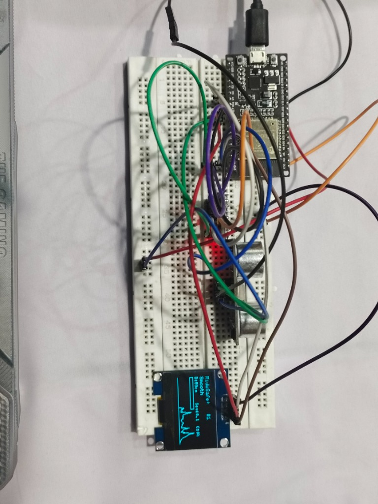

# RideSafe+

## 1. Project Title
**RideSafe+** — Industry-Level Stable Pothole & Road Anomaly Detection System

## 2. Project Overview
RideSafe+ is an intelligent hardware system designed for vehicles (bicycles, scooters, motorcycles) that detects potholes and road anomalies in real-time. By fusing data from an MPU6050 (Accelerometer/Gyroscope) and an HC-SR04 Ultrasonic Sensor, it achieves a high level of accuracy and effectively rejects false positives like ramps, normal road bumps, and sensor noise.

## 3. Features
- **Multi-Sensor Fusion**: Combines IMU vibration tracking with ultrasonic depth measurement.
- **Smart Logic Rejection**: Specifically ignores monotonic distance changes (e.g., ramps/hills) and only triggers on true anomalies (sharp drop + rise, paired with a jolt).
- **Auto-Calibration**: Dynamically calculates the baseline gravity and noise floor on startup.
- **Live OLED Dashboard**: Displays a real-time severity graph, distance, confidence score, and total pothole count.
- **Data Logging**: Outputs CSV-formatted telemetry data over Serial for further analysis or machine learning integration.
- **Non-blocking Architecture**: Operates efficiently on the ESP32 using `millis()` timing, allowing multiple sensors and the display to update seamlessly.

## 4. Components Used
- **Microcontroller**: ESP32 Development Board
- **IMU**: MPU6050 (6-axis Accelerometer & Gyroscope)
- **Distance Sensor**: HC-SR04 Ultrasonic Sensor
- **Display**: 1.3" or 0.96" OLED Display (SH1106 / SSD1306, 128x64, I2C)
- **Miscellaneous**: Breadboard, Jumper wires, USB Cable for power/programming.

## 5. Circuit Diagram

## 6. Working Principle
1. **Vibration Tracking (IMU)**: Calculates "Jerk" (the rate of change of acceleration) by comparing fast and slow Exponential Moving Averages (EMA). This isolates sudden, sharp impacts from general riding vibrations.
2. **Depth Tracking (Ultrasonic)**: Measures the distance to the road surface continuously, using median filtering to eliminate noise. It maintains a rolling history to establish a stable baseline.
3. **Detection Algorithm**: When an anomaly occurs, the ESP32 computes a Confidence Score based on:
   - A physical drop in distance (depth anomaly).
   - A spike in physical jerk (impact anomaly).
   - Evidence of a "reversal" (distance dropping quickly into a hole and rising back out).
4. **Trigger & Display**: If the Confidence Score exceeds 50% for multiple frames, a pothole is confirmed, logged, and categorized by severity (LOW, MED, HIGH) on the OLED screen.

## 7. Pin Connections

| Component   | Pin Name | ESP32 Pin |
| ----------- | -------- | --------- |
| **MPU6050** | SDA      | GPIO 4    |
|             | SCL      | GPIO 5    |
|             | VCC      | 3.3V      |
|             | GND      | GND       |
| **OLED**    | SDA      | GPIO 4    |
|             | SCL      | GPIO 5    |
|             | VCC      | 3.3V      |
|             | GND      | GND       |
| **HC-SR04** | Trig     | GPIO 12   |
|             | Echo     | GPIO 18   |
|             | VCC      | 5V (or VIN)|
|             | GND      | GND       |

## 8. Code Explanation
The code is divided into highly modular functions to ensure readability and maintainability:
- `mpuInit()` & `calibrateImu()`: Configures the IMU and measures baseline noise.
- `ultraRead()`: Fetches distance and applies a median filter across three rapid samples.
- `imuUpdate()`: Calculates live Jerk via Exponential Moving Averages.
- `runDetection()`: The core fusion logic. Compares distance deltas against historical baselines and evaluates the IMU jerk to calculate a final confidence score.
- `updateDisplay()`: Uses the `U8g2` library to render the live UI and scrolling graph.
- `serialLog()`: Spits out comma-separated values (CSV) for debugging or data plotting.

## 9. Libraries Used
- `Wire.h` (Built-in I2C)
- `U8g2lib.h` (For the OLED Display)

## 10. Installation / Setup Instructions
1. Install the Arduino IDE.
2. Add the **ESP32 Board Manager** via `Preferences -> Additional Board Manager URLs`: `https://dl.espressif.com/dl/package_esp32_index.json`
3. Install the required libraries via the Arduino Library Manager.
4. Clone or download this repository.
5. Place your `circuit_diagram.png` in the root folder.
6. Open `RideSafePlus.ino` in the Arduino IDE.

## 11. How to Upload Code to Arduino/ESP32
1. Connect your ESP32 to your computer via USB.
2. Go to **Tools > Board** and select your specific ESP32 model (e.g., `DOIT ESP32 DEVKIT V1`).
3. Go to **Tools > Port** and select the active COM port.
4. Click the **Upload** arrow button.
5. *(Troubleshooting)*: If the IDE says "Connecting...", hold down the `BOOT` button on the ESP32 until the upload begins.

## 12. Expected Output / Behavior
- **On Startup**: The OLED will show "RideSafe+ INIT". Keep the device still for a few seconds so it can calibrate gravity and background noise.
- **While Riding**: The screen will show a live scrolling graph, the distance to the ground, and a severity meter.
- **On Pothole**: The screen will flash "POTHOLE!" along with the severity (LOW/MED/HIGH), the graph will spike, and the pothole counter will increment.

## 13. Future Scope
- Add an SD Card module to log GPS coordinates of detected potholes.
- Integrate a GSM/WiFi module to upload pothole data to a central city server or cloud dashboard.
- Utilize Edge AI/TinyML to further classify different types of road anomalies (e.g., speed bumps vs. potholes).

## 14. Author
**Darsh Sharma**  
*Embedded Systems & Agentic AI Engineer*
